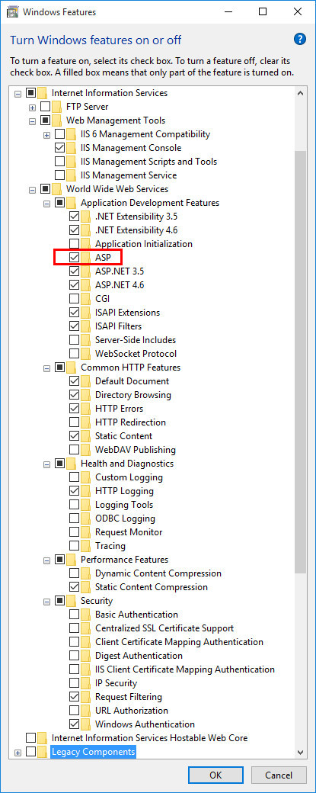
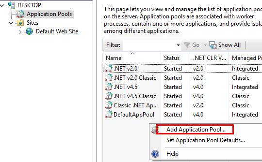
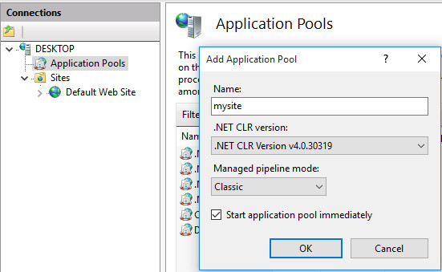
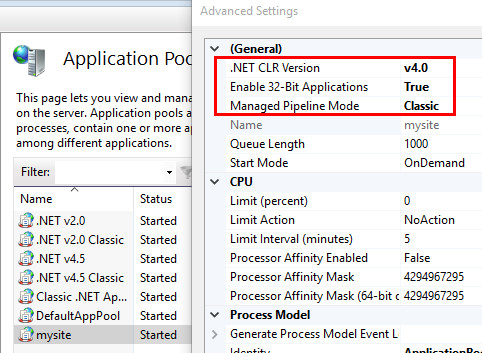
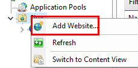
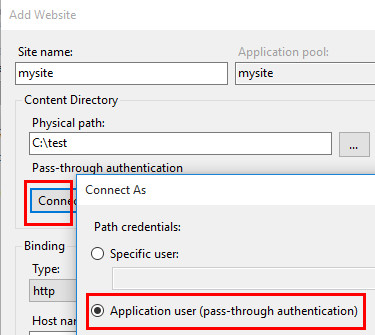
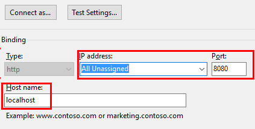
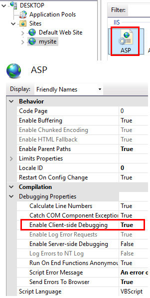

## Debug ASP Classic with Visual Studio

* you running the website with `IIS Management Console` (not IIS Express), tested on windows10x64
* on EDGE, you using the option **Reload in Internet Explorer mode**
* Open the Classic ASP folder in Visual Studio and set a breakpoint to a file for test
* Debug Menu > Attach to Process (make sure you check `Show processes from all users`)
* On `Attach to` option select `Script code`
* Locate the IIS ASP worker process (`w3wp.exe` on IIS v6-v10, `dllhost.exe` on IIS5.1)
* Press `Attach` button

[source](https://stackoverflow.com/a/1765105)

 > tested with VS2017 most probably working on latest VS as well..

 ---

  
  
  
  
  
  
  
  

---

VSCode : 
* [Classic ASP Syntaxes](https://marketplace.visualstudio.com/items?itemName=jtjoo.classic-asp-html) [[2](https://github.com/jtjoo/vscode-classic-asp-extension)]
* [VBA](https://marketplace.visualstudio.com/items?itemName=serkonda7.vscode-vba)
* [GumDotNet Form Viewer](https://marketplace.visualstudio.com/items?itemName=preechagum.gumdotnet-form-viewer)